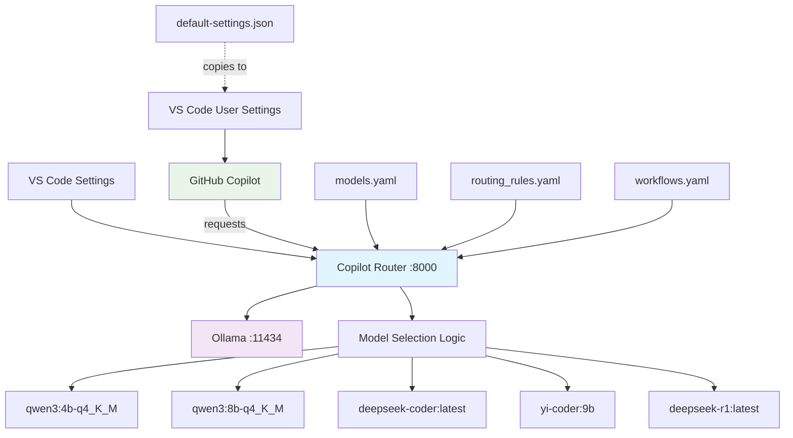
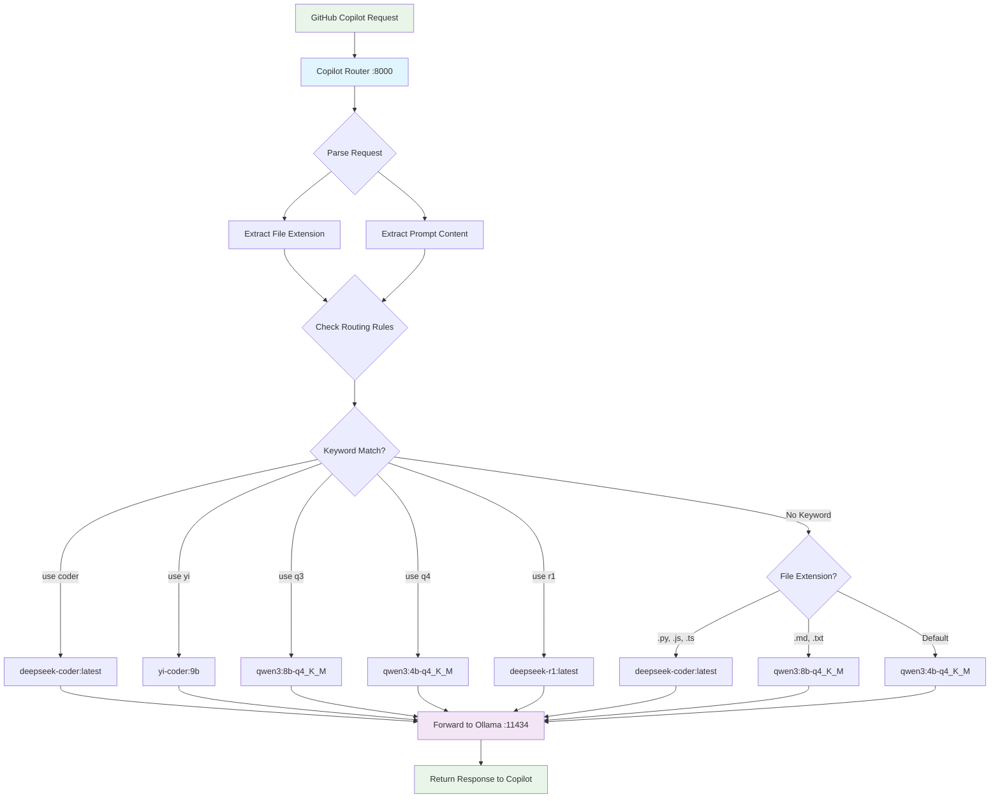

# Copilot Router

An intelligent AI model routing system that seamlessly integrates with GitHub Copilot to automatically select the best local Ollama model based on file types, prompt keywords, and coding context.

## 🚀 Features

- **Intelligent Model Selection**: Automatically routes requests to optimal models based on file extensions and prompt content
- **GitHub Copilot Integration**: Works transparently with VS Code's GitHub Copilot
- **Local Ollama Models**: Routes to your local Ollama installation for privacy and speed
- **Smart Keyword Detection**: Use special commands like "use coder", "use yi", etc. to force specific models
- **Real-time Logging**: See routing decisions with emoji-enhanced logs
- **OpenAI API Compatible**: Exposes OpenAI-compatible endpoints for seamless integration

## 📁 Project Structure



## 🗂️ File Descriptions

### Core Application Files

| File | Purpose | Description |
|------|---------|-------------|
| `main.py` | **Core Router** | FastAPI application that handles routing logic, model selection, and request forwarding |
| `models.yaml` | **Model Registry** | Defines available Ollama models and their endpoints |
| `routing_rules.yaml` | **Routing Logic** | Rules for selecting models based on file extensions and prompt keywords |
| `workflows.yaml` | **Workflow Definitions** | Advanced routing workflows for complex scenarios |
| `tools.py` | **Utility Functions** | Helper functions for model management and routing |
| `memory.py` | **Context Management** | Handles conversation context and memory |
| `benchmark.py` | **Performance Tracking** | Benchmarks and performance monitoring |

### Configuration Files

| File | Purpose | Description |
|------|---------|-------------|
| `default-settings.json` | **VS Code Config Template** | Template VS Code settings for GitHub Copilot integration |
| `StartupRouter.sh` | **Server Launcher** | Script to start the router with proper logging |
| `CopyConfigToSystem.sh` | **Config Installer** | Copies settings to VS Code user configuration |
| `BuildOxygenThenDisplay.sh` | **Documentation** | Builds and displays project documentation |
| `Doxyfile` | **Doxygen Config** | Configuration for generating code documentation |

## 🛠️ Setup Instructions

### 1. Prerequisites

- **Ollama**: Install and ensure it's running on `localhost:11434`
- **Python**: Python 3.8+ with pip
- **VS Code**: With GitHub Copilot extension

### 2. Install Dependencies

```bash
pip install fastapi uvicorn httpx pyyaml
```

### 3. Configure VS Code Settings

```bash
# Copy the router settings to VS Code
./CopyConfigToSystem.sh
```

This copies `default-settings.json` to your VS Code user settings, configuring GitHub Copilot to use the router.

### 4. Start the Router

```bash
./StartupRouter.sh
```

This starts the router on `http://localhost:8000` with enhanced logging.

## 🎯 Model Selection Flow



## 🎮 Usage Instructions

### Special Keywords for Model Selection

Use these keywords in your prompts to force specific model selection:

| Keyword | Model | Best For |
|---------|-------|----------|
| `"use coder"` | deepseek-coder:latest | Code optimization, debugging, refactoring |
| `"use yi"` | yi-coder:9b | Advanced coding, architecture design |
| `"use q3"` | qwen3:8b-q4_K_M | General purpose, larger context |
| `"use q4"` | qwen3:4b-q4_K_M | Fast responses, simple tasks |
| `"use r1"` | deepseek-r1:latest | Reasoning, complex problem solving |

### Example Usage

```typescript
// In VS Code, type in chat or as a comment:
// "use coder to optimize this function for performance"

function slowFunction(data: any[]) {
    // GitHub Copilot will route to deepseek-coder via the router
    return data.filter(item => item.active).map(item => item.value);
}
```

## 🔍 Monitoring and Logging

The router provides detailed logging with emojis for easy monitoring:

```bash
2025-09-08 13:53:15,075 - copilot-router - INFO - Loaded 5 models from models.yaml
2025-09-08 13:53:15,076 - copilot-router - INFO - Loaded 9 routing rules from routing_rules.yaml
🔍 Routing request: file='test.py' (ext: py), prompt='use coder to optimize...'
✅ Rule 3 matched! Routing to: ollama.com/library/deepseek-coder:latest
📝 Matched keywords: ['use coder']
🚀 Forwarding to ollama.com/library/deepseek-coder:latest at http://localhost:11434
⚡ Response received in 2.34s
```

## ⚠️ Important Notes

### Models Don't Appear in Dropdown

**The router models will NOT appear in GitHub Copilot's model dropdown.** This is intentional - the routing happens transparently at the API level. GitHub Copilot thinks it's talking to OpenAI's API, but the router intelligently selects the best local model.

### Configuration Persistence

The `CopyConfigToSystem.sh` script modifies your global VS Code settings. To revert:

1. Open VS Code Settings (⌘,)
2. Search for "github.copilot"
3. Remove or modify the custom endpoint settings

## 🔧 Configuration Files

### models.yaml

```yaml
models:
  ollama.com/library/qwen3:4b-q4_K_M:
    endpoint: "http://localhost:11434"
    mode: "chat"
  ollama.com/library/deepseek-coder:latest:
    endpoint: "http://localhost:11434"
    mode: "chat"
  # ... more models
```

### routing_rules.yaml

```yaml
routing_rules:
  - match:
      prompt_contains: ["use coder"]
    route_to: "ollama.com/library/deepseek-coder:latest"

  - match:
      file_extensions: [".py", ".js", ".ts"]
    route_to: "ollama.com/library/deepseek-coder:latest"
  # ... more rules
```

## 🚀 API Endpoints

The router exposes OpenAI-compatible endpoints:

- `POST /v1/chat/completions` - Main chat endpoint
- `GET /v1/models` - List available models
- `GET /health` - Health check endpoint

## 🐛 Troubleshooting

### Router Not Responding

1. Check if Ollama is running: `ollama list`
2. Verify router is running: `curl http://localhost:8000/health`
3. Check logs in the terminal running `StartupRouter.sh`

### Models Not Working

1. Verify model names match exactly: `ollama list`
2. Check `models.yaml` has correct model names
3. Test Ollama directly: `curl -X POST http://localhost:11434/v1/chat/completions -H "Content-Type: application/json" -d '{"model":"ollama.com/library/qwen3:4b-q4_K_M","messages":[{"role":"user","content":"Hello"}]}'`

### GitHub Copilot Integration Issues

1. Verify settings copied correctly: Check VS Code settings for custom endpoints
2. Restart VS Code after configuration changes
3. Check VS Code developer console for network errors

## 📊 Performance

The router adds minimal latency (~10-50ms) while providing intelligent model selection. Local Ollama models typically respond faster than remote APIs while maintaining privacy.

## 🤝 Contributing

1. Fork the repository
2. Create a feature branch
3. Make your changes
4. Test thoroughly
5. Submit a pull request

## 📝 License

This project is licensed under the MIT License.

---

**Happy Coding with Intelligent Model Routing! 🎯🚀**

