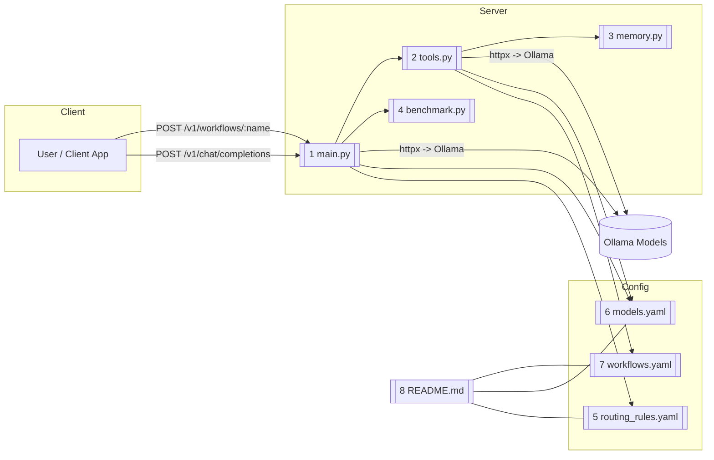

# Copilot Router

This project lives in:  
```
{User Directory}/.vscode/copilot-router
```
It provides a **FastAPI-based router** for managing AI model calls via **Ollama**, executing **multi-step workflows**, and logging **performance benchmarks**.  
With it, you can:
- Route requests to different AI models based on **file type** or **prompt content**.
- Run **multi-step pipelines** that call multiple models or tools in sequence.
- Log **latency metrics** for every model call.
- Manage configuration directly inside VS Code.

---

## Architecture Overview

The system uses three layers:

1. **Server Layer** → Handles HTTP requests and model routing.
2. **Config Layer** → YAML files define routing, models, and workflows.
3. **Utility Layer** → Benchmarking and memory caching modules.

---

## File Locations

| File/Folder                  | Purpose                                   | Location                                      |
|------------------------------|-------------------------------------------|-----------------------------------------------|
| `main.py`                     | FastAPI server & routing                  | `{User}/.vscode/copilot-router/main.py`        |
| `tools.py`                    | Workflow execution logic                  | `{User}/.vscode/copilot-router/tools.py`       |
| `memory.py`                   | Temporary in-memory cache                 | `{User}/.vscode/copilot-router/memory.py`      |
| `benchmark.py`                | Benchmark logging                         | `{User}/.vscode/copilot-router/benchmark.py`   |
| `routing_rules.yaml`          | Routing conditions for model selection    | `{User}/.vscode/copilot-router/routing_rules.yaml` |
| `models.yaml`                  | Registry of model endpoints (Ollama)      | `{User}/.vscode/copilot-router/models.yaml`    |
| `workflows.yaml`               | Multi-step pipelines definition           | `{User}/.vscode/copilot-router/workflows.yaml` |
| `README.md`                   | This documentation                        | `{User}/.vscode/copilot-router/README.md`      |

---

## Mermaid Diagram



---

## Installing Models in Ollama

Ollama serves all models locally. Install them with:

```bash
ollama pull https://ollama.com/library/qwen3:8b-q4_K_M
ollama pull https://ollama.com/library/qwen3:4b-q4_K_M
ollama pull https://ollama.com/library/deepseek-coder
ollama pull https://ollama.com/library/deepseek-r1
ollama pull https://ollama.com/library/yi-coder:9b

```

These models will be referenced in `models.yaml`.

---

## YAML Files with Doxygen Comments

You can add Doxygen-style comments in YAML like this:

```yaml
# @file models.yaml
# @brief Registry of all Ollama models and endpoints.
# @details Each model entry defines the endpoint URL and additional metadata.

models:
  qwen:4b:
    endpoint: "http://localhost:11434"   # @note Default Ollama endpoint
    mode: "chat"                          # @note Mode can be chat or completion
```

Similarly, for routing rules:

```yaml
# @file routing_rules.yaml
# @brief Rules for selecting the right model.
# @details Matches file types and prompt keywords.

routing_rules:
  - match:
      file_extension: ["py"]    # @note Python files route here
      prompt_contains: ["fix", "optimize"]
    route_to: "qwen:4b"
```

And workflows:

```yaml
# @file workflows.yaml
# @brief Declarative pipelines for multi-step tasks.
# @details Each step can be a model call or external tool.

workflows:
  my_workflow:
    - type: model
      model: qwen:4b
      action: "Summarize the text"
    - type: model
      model: llama2:7b
      action: "Refine the summary"
```

---

## VS Code Configuration Changes

1. **Project Folder:**  
   Ensure `{User}/.vscode/copilot-router` is opened in VS Code.

2. **Settings Sync:**  
   Add `.vscode/settings.json` with:
   ```json
   {
     "python.defaultInterpreterPath": "python3",
     "files.autoSave": "afterDelay"
   }
   ```

3. **Run Server in VS Code:**  
   Add `.vscode/tasks.json`:
   ```json
   {
     "version": "2.0.0",
     "tasks": [
       {
         "label": "Run Copilot Router",
         "type": "shell",
         "command": "uvicorn main:app --reload",
         "group": "build",
         "isBackground": true,
         "problemMatcher": []
       }
     ]
   }
   ```
   Run with **Cmd+Shift+P → Tasks: Run Task → Run Copilot Router**.

4. **HTTP Client Extensions:**  
   - Install **REST Client** or **Thunder Client** in VS Code for testing endpoints.

---

## Running the Project

### 1. Install dependencies
```bash
pip install fastapi uvicorn httpx pyyaml
```

### 2. Start the API server
```bash
cd ~/.vscode/copilot-router
uvicorn main:app --reload
```

### 3. Send a test request
```bash
curl -X POST "http://127.0.0.1:8000/v1/chat/completions"      -H "Content-Type: application/json"      -d '{"file":"test.py","messages":[{"role":"user","content":"Optimize this code"}]}'
```

---

## Future Enhancements
- Add persistent caching for workflow results.
- GUI for editing YAML routing rules.
- Model performance auto-benchmarking.

