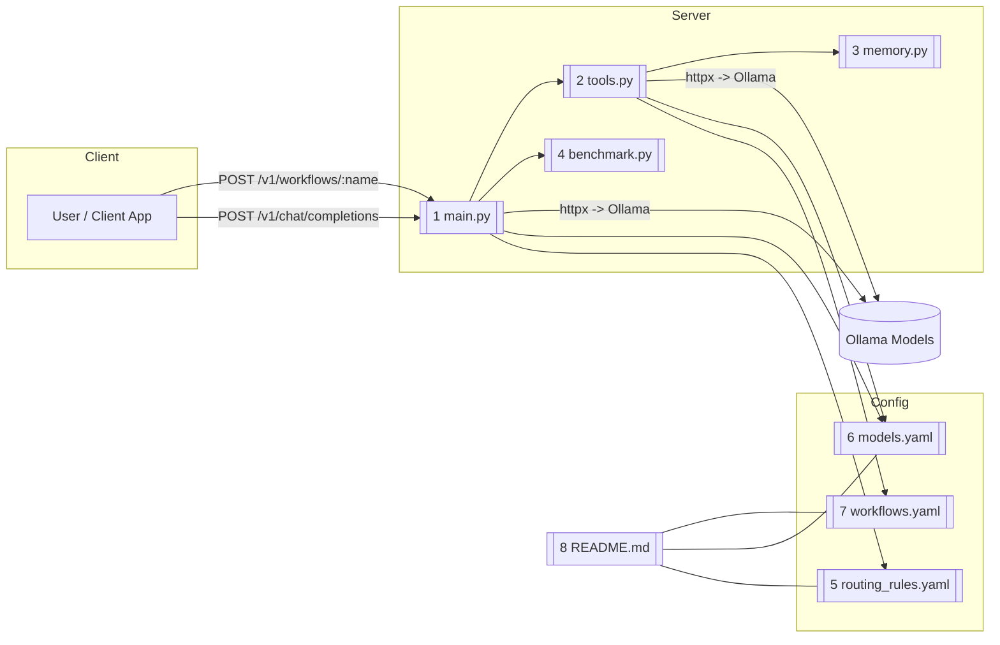

# Copilot Router

This project lives in:
```
{User Directory}/.vscode/copilot-router
```
It provides a **FastAPI-based router** for managing AI model calls via **Ollama**, executing **multi-step workflows**, and logging **performance benchmarks**.

It includes detailed Doxygen documentation for Python files, YAML configuration files, and Markdown documentation including this README.

---

## Architecture Overview

The system uses three layers:

1. **Server Layer** → Handles HTTP requests and model routing.
2. **Config Layer** → YAML files define routing, models, and workflows.
3. **Utility Layer** → Benchmarking and memory caching modules.

---

## Mermaid Diagram



---

## Installing Models in Ollama

Ollama serves all models locally. Install them with:

```bash
ollama pull qwen3:4b
ollama pull qwen3:8b
ollama pull deepseek-coder:6b
ollama pull yi-coder:9b
ollama pull deepseek-r1
```

These models will be referenced in `models.yaml`.

---

## YAML Files with Doxygen Comments

You can add Doxygen-style comments in YAML like this:

```yaml
# @file models.yaml
# @brief Registry of all Ollama models and endpoints.
# @details Each model entry defines the endpoint URL and mode.
# @note Modes: chat, inline, agent
```

Similarly, for routing rules:

```yaml
# @file routing_rules.yaml
# @brief Rules for selecting models based on file type and prompt keywords.
```

And workflows:

```yaml
# @file workflows.yaml
# @brief Declarative pipelines for multi-step tasks.
```

---

## VS Code Configuration Changes

1. Open `{User}/.vscode/copilot-router` in VS Code.
2. Add `.vscode/settings.json` with recommended Python interpreter.
3. Add `.vscode/tasks.json` to run `uvicorn main:app --reload` as a background task.
4. Use REST Client or Thunder Client to test endpoints.

---

## Running the Project

### 1. Install dependencies
```bash
pip install fastapi uvicorn httpx pyyaml
```

### 2. Start the API server
```bash
cd ~/.vscode/copilot-router
uvicorn main:app --reload
```

### 3. Send a test request
```bash
curl -X POST "http://127.0.0.1:8000/v1/chat/completions"      -H "Content-Type: application/json"      -d '{"file":"test.py","messages":[{"role":"user","content":"Optimize this code"}]}'
```

---

## Future Enhancements

- Persistent caching for workflow results.
- GUI for editing YAML routing rules.
- Model performance auto-benchmarking.
- Include Markdown tutorials and docs in Doxygen HTML output.